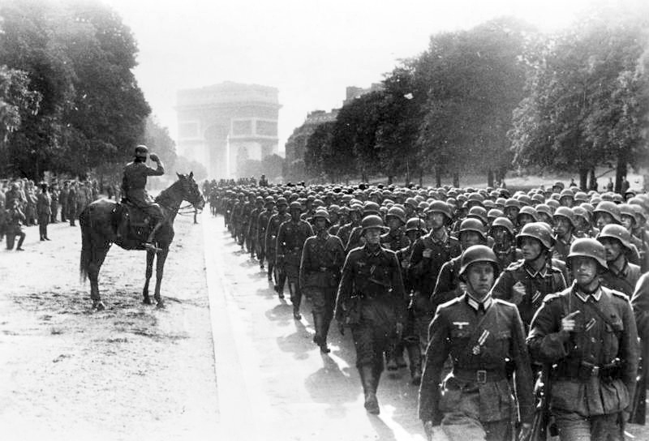
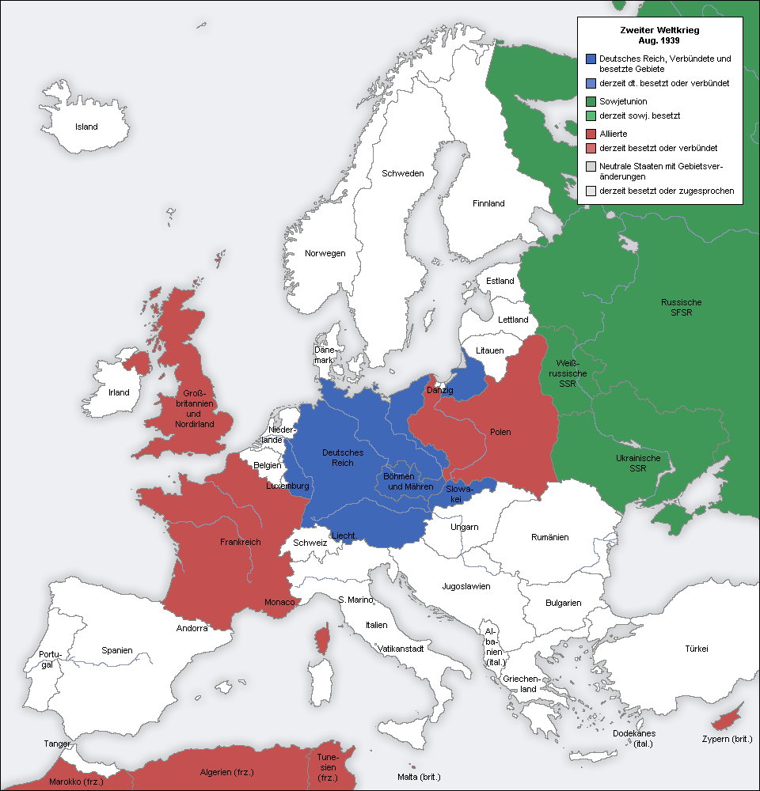

# 读《我的奋斗》

读完最大的感受是，所有的信息还是应该从最原始的出处入手，因为在传播的过程中会受到各种扭曲和删减。

受了太多影视作品的影响，一直以为希特勒是工于心计、竭力伪装成正常人的疯子，这种说法不仅侮辱了德国人，也侮辱了全世界。纵然希特勒有很多可笑的言论，那培育纯种狗一般的种族理论（众所周知，越纯种的狗越是体弱多病和短寿）而由此衍生的生存空间理论，但他不是每句话都是错的，有些观点恰恰说中了要害而被隐藏起来，如果以为胜利者可以岁月史书，只有败者需要反思，那双方的死难者真就白死了。

## 反犹

为什么会有犹太人大屠杀？初步解释是希特勒是种族主义者，他反犹，但这不是最终答案，还要继续问，为什么希特勒反犹？虽然希特勒自己解释得非常清楚，但我之前从来不知道这个原因，它被刻意淡化了：

> 我拿了很多随处可得的社会民主党的宣传册并找出作者的姓名：犹太人。我把所有领导人的姓名都标注出来；发现大部分竟然都是和“上帝的特选子民”有关的人员，如国会议员的代表或是工会的书记，什么组织的主席甚至还有大街上进行煽动的宣传员。同时总会呈现出令人毛骨悚然的画面。像奥斯特里茨、大卫王、阿德勒和爱伦波根等等，这样的名字会永远留在我的记忆中的。我现在明白了一件事：就是这个党，几个月来我一直和这些坏蛋们激烈地斗争着，可是党的领导权却差不多全落在一个外族的手里；而有幸聊以自慰的是我从内心里觉得终于知道了犹太人不是德国人。

我很庆幸是今年而不是早几年看的这书，那时候包括巴以冲突在内的很多问题没有尖锐化（但其实这些可能也是我看这书的部分原因）。希特勒自述的反犹原因是，犹太人把握了议会、控制了德国的政治，这里我们可以看一个实例：现在的美国。

我不太了解美国的政体，简单地认为[美国总统继任顺序](https://zh.wikipedia.org/w/index.php?title=%E7%BE%8E%E5%9C%8B%E7%B8%BD%E7%B5%B1%E7%B9%BC%E4%BB%BB%E9%A0%86%E5%BA%8F&oldid=849602860)是美国的政治权利排序，这 18 人里

* 第 4 国务卿 Antony Blinken
* 第 5 财政部长 Janet Yellen
* 第 7 司法部长 Merrick Garland
* 第 18 国土安全部长 Alejandro Mayorkas 

这些人是犹太人，有 4 人，分母加上总统有 19 人，所以占比是 21%，只看前十的话是 30%，而犹太人人口占美国人口的多少呢？约 2.2%。这显然是个不正常的比例。还有其他一些数据，如[历史上 16 位美联储主席有 6 名犹太人](https://i.ifeng.com/c/8V5L48O2Vm4)。很难准确查到，希特勒在写书的时候，德国政府有多少犹太人。我不能说希特勒反犹是合理的，但包括希特勒在内的很多人反犹的原因是合理的。比如特朗普的女婿是犹太人，特朗普在总统任期内正式承认以色列对戈兰高地的主权，这些事情损害了美国的利益，如今的美国亏得起，但当时一战战败后的德国可亏不起了。

顺便说下我个人的反犹立场的，这个概念有点错乱，是因为它对应了好几个概念，不应该混为一谈。我认识的嫁到以色列的华人，看她 facebook 上记录在空袭警报下生活的孩子，他们是犹太人，可在加沙[犯下强奸杀害妇女儿童罪行](https://www.ohchr.org/zh/press-releases/2024/02/israelopt-un-experts-appalled-reported-human-rights-violations-against)的以色列士兵也是犹太人，美国政府和美联储里的犹太帮也是犹太人。另外令我吃惊的是，二战后的犹太人人口到现在只增加了 60%，而要知道这期间全世界人口已经增加了近 180%，感觉这个种族在不断筛选淘汰不配做犹太人的人。作为区分应该分成上犹太人和下犹太人，上犹太人作恶的时候，下犹太人跟着遭殃。

## 反共产主义

看书之前我没搞明白国家社会主义跟共产主义的区别，如果都是“人民当家作主”，好像二者有不少共同点，为何希特勒会如此仇视马克思？一切的原因就是 1919 年[德国十一月革命](https://zh.wikipedia.org/zh-hans/%E5%BE%B7%E5%9B%BD%E5%8D%81%E4%B8%80%E6%9C%88%E9%9D%A9%E5%91%BD)，希特勒当时还在当兵在前线打仗，从他的感受是战争还可以坚持，然而兵工厂的工人组织罢工真的是釜底抽薪，直到他感觉这是德国投降的直接原因。另可参见 wiki 词条[刀刺在背传说](https://zh.wikipedia.org/wiki/%E5%88%80%E5%88%BA%E5%9C%A8%E8%83%8C%E4%BC%A0%E8%AF%B4)。

无从判断当时的罢工工人的选择是否正确，毕竟我们完全无法感受当时德国民众的生活有多困苦，但是当时战时的那种痛苦，跟随后发生的[魏玛时期恶性通胀](https://zh.wikipedia.org/zh-hans/%E5%A8%81%E7%91%AA%E5%85%B1%E5%92%8C%E5%9C%8B%E6%83%A1%E6%80%A7%E9%80%9A%E8%B2%A8%E8%86%A8%E8%84%B9)，哪个更严重？那些工人会后悔么？但至少理解了，从希特勒的视角，他认为是俄国犹太人煽动了德国无产阶级的罢工，导致了德国陷入深渊，否则至少不会败得这么惨。这也是我之前思考过的问题，就是阶级斗争只是一个角度，而看问题要有很多个角度，德国无产阶级跟德国资产阶级是对立的，但是从法国人英国人看来，你们都是德国人，一损俱损。

> 因此，对于国家社会主义的工会组织来说，罢工就不仅是一种摧毁和动摇国民生产的手段，而且还是通过和一切带有不符合社会需求特性、阻碍经济生产效率、因而也阻碍全体人民生存的弊端所进行的斗争来提高国民经济生产和筹措资金的方法。

当看到希特勒主张不应该有罢工（兵工厂罢工是他最深的痛），我心想现在的中国倒是与之很相似，进一步翻阅 wiki 得知这个想法的主体是[国有社会主义](https://zh.wikipedia.org/wiki/%E5%9C%8B%E6%9C%89%E7%A4%BE%E6%9C%83%E4%B8%BB%E7%BE%A9)。很多人不相信“有国才有家”的概念，觉得是 PUA，但想想兵工厂罢工工人
，或者脑海里继续把这个困境极端化，应该承认，国家视角跟阶级斗争视角一样重要。或者有人的想法是这个问题对自己不重要，自己有钱可以轻易改变身份：国籍、种族，这想法很可能是错的。

无论如何，当时欧洲列强纷争的形势还不适合当时的德国无产阶级，共产国际害了他们，不然他们也不会在罢工十几年后选出希特勒了。共产主义同样是希特勒反犹的原因之一。

另外，要灭亡德国，需要多少德国人参与呢？

> 人们对于这样一个事实完全不必常常牢记在心上。只是谁能够理解和明白一个十分之九的人们没有参加革命行动，十分之七的人们拒绝这场革命，十分之六的人们仇视这场革命的民族，是怎么可能最终被这十分之一的人们强迫来接受这场革命的。

虽然这个比例只是希特勒粗略的体感，但确实大部分民众其实是不关心政治，正因如此，最近几年的美国选举，大家都在关注如何让以前不投票的人参与进来。

## 冲锋队

希特勒上台前，最大的对手不是政府，而是共产党……他们不断在希特勒的演讲会上制造骚乱。骚乱足够大，引来警察并宣布停止演讲，就达到了目的。逐渐地，演讲时维持秩序对抗共产党捣乱的队伍后来叫做冲锋队，再后来演化成党卫军。

> 当我在七点四十五分来到会场大厅前面的时候几乎无法相信眼前所看到的景象。会场爆满并且还有警察在进行警戒。提前到场的捣乱分子在会场里面，而支持我们的人却大部分在场外。一小部分冲锋队员在会场前厅等着我。我让他们关上通往大厅的门，并命令这四十五名或是四十六名冲锋队员列队站好。我告诉这些小伙子们今天也许就是他们必须第一次要不惜一切代价地捍卫自己对这场政治运动忠诚的时刻，我们中的任何人都不许离开会场，除非他们是当作死人给抬出去的，我自己也要留在会场里，我无论如何也不会相信你们会弃我而去，但我自己要看出谁是胆小鬼，我就要亲自撕下他的袖标，拿走他的徽章。然后我就要求他们那怕是最细微的捣乱行为都要立即采取行动并且还要时刻牢记要尽量防备自己也会遭到攻击。
>
> 这次是以无比粗犷激昂的声音三次高呼万岁作为回答的。

## 法国

一战结束，签署《凡尔赛条约》时，胜利方协约国的联军总司令福煦评价说，这不是和平，只是二十年的休战（ce n'est pas une paix, c'est un armistice de vingt ans），条约于 1919 年 6 月 28 号签署，二十年又六十五天后的 1939 年 9 月 1 日，纳粹德国闪击波兰，欧洲战争开始。又过了九个月，德军通过凯旋门，在福煦大街上行进。

二战结束后，德国当然更惨，但英国和法国也丧失了优势地位，民族运动兴起，各殖民地纷纷独立。

这就是福煦元帅所预见到的后果，法国要么彻底铲除德国，使之为殖民地而不再是独立国家（问题是英国不会允许法国独大），要么不要把德国压榨得这么狠。1923 年[法国占领鲁尔区](https://zh.wikipedia.org/zh-hans/%E5%8D%A0%E9%A2%86%E9%B2%81%E5%B0%94)，书的结尾希特勒是这么评价的：

> 随着鲁尔区的被占领，命运反倒又给了德意志民族再次振兴的机会。因为粗看起来好像这是大祸临头，但是仔细观察反而却包含着完全使德国脱离苦难有着无限希望的可能。

基于 wiki 词条，可以有罗生门般的多种推测，法国认为赔款已经下调，但德国仍不能履行，法国认为德国在试探协约国对履行凡尔赛条约的决心。英美拒绝跟随法国对德国进行干预，因为受益的主要是法国。德国随后发生了通胀，所以不履行赔款并开始通胀是有预谋的：

> 德国有可能在 1921 年 11 月赔款过程开始之前即已做好通货膨胀的准备。面对着崩溃的经济以及居高不下的失业率和通货膨胀率，1923 年 9 月上台的由古斯塔夫·施特雷泽曼领导的联合政府最终叫停了罢工并宣布国家进入紧急状态。尽管如此，此时还是发生了一些起针对魏玛德国的未遂政变，其中包括啤酒馆暴动。

而本书的成因，就是啤酒馆暴动未遂、希特勒被送进监狱后口述的。序言的第二页就列举了为啤酒馆暴动而献身的 15 个人的名字。

以前我意识到计划经济不可能持续，是因为实际需求是无法计算的，构成整个国家的元素——一个个人——太复杂，无法标准化。现在推广一下，即使是一个国家的总体能力，也是无法计算的，每个政权无法准确评估自己，也无法评估他国，那在极端条件下赌一下反而是最优策略。因为找不到全知全能的上帝来评判，所以有限信息有限理性的博弈就是如此混乱，只有发生完后反推的时候才能理清因果关系。经过 6 个月漫长的巴黎和会、最终在《凡尔赛条约》上签字的英法政府决策者们，会像之前在德国兵工厂闹罢工的工人一样感到后悔么？

------

《我的奋斗》讲述了前后共二十年的历史：之前十年的结果，和之后十年的起因，继而影响了全人类最近一百年的历史。德国的国歌是这样的：

> 德意志，德意志，高于一切，  
> 高于世间所有万物；  
> 无论何时，为了保护和捍卫，  
> 兄弟们永远站在一起。  
> 从马斯到默默尔，  
> 从埃施到贝尔特，  
> 德意志，德意志，高于一切，  
> 高于世间所有万物。  
> 德意志，德意志，高于一切，  
> 高于世间所有万物。

国歌歌词里的四个地名，马斯河、梅梅尔河、埃施河以及贝尔特海峡，现在都不在德国境内。应该意识到，他们没有改歌词，就是为了记住这件事，在历史长河中，所有国家的版图都是在变化着，一百年对于历史来说真的不算多，以后会发生什么还不好说。正如所谓“二十年的休战”一样，从长期来讲，德国和日本的士兵重新踏出国门（非联合国授权的维和）是必然的事情，但是又怎么样呢？又不可能现在彻底夷平他们。

顺便推荐一张 gif 图，六年的历史用一分钟讲完：

对历史的看法不应该保持白莲花一样的天真、预设好人坏人，只有输赢而已。能强大到引起你注意的国家，没有一个是善茬。在一群利维坦中，不够残忍狡诈的利维坦早已经被分食，要知道各国领导人的筛选机制上，无论哪种政体，都保证了只有足够贪婪和野心的人才能可能当选。

另外所有的信息都是裁剪过的，比方说前头说起希特勒仇视共产主义的原因，还有个信息是我看完书后看 wiki 时顺便知道的：1917 年，一战还没结束的时候，德国人故意把列宁放回了俄国，年初回去的，年底就是十月革命，本意是在俄国制造混乱，减轻德国的东线压力，可一年后就是德国十一月革命了，怎么看都有点讽刺。你很难说哪个“受害者”是无辜的，所有种族都处在血腥或者不够血腥的竞争中。如果不说这段，好像缺了点什么，但其实这错杂的因果关系，不是一篇短文可以讲完的，比人高的书都讲不完。

历史会不断重演，多读历史并不能减少战争的发生，可能仅仅是让普通人，在战争来临时，更清楚自己是怎么死的。
